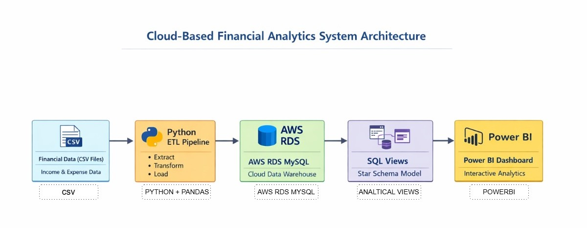
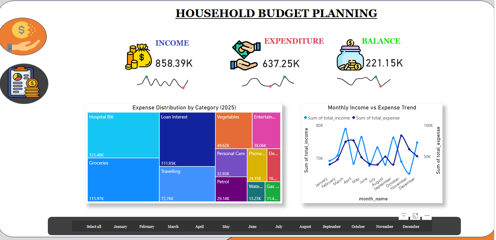
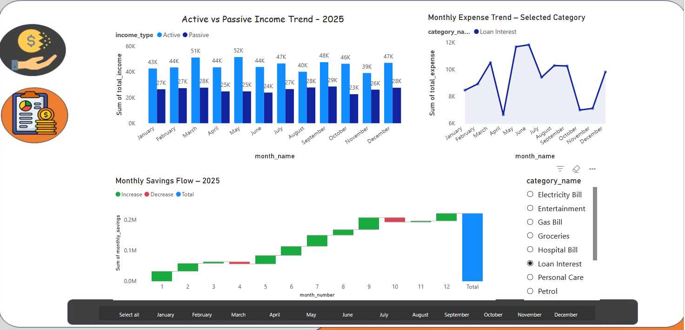

# ☁️ Cloud Financial Analytics System

## 📌 Project Overview
This project builds an **end-to-end cloud-based financial analytics system** that transforms raw financial data into actionable insights.

The system automates data processing using a **Python ETL pipeline**, stores structured data in a **cloud MySQL database (AWS RDS)**, and delivers interactive insights through **Power BI dashboards**.

The objective is to enable **clear financial monitoring, expense analysis, and savings tracking** through a scalable analytics architecture.

---

# 🏗 System Architecture

### Data Flow

Raw CSV Data  
⬇  
Python ETL Pipeline  
⬇  
AWS RDS MySQL Database  
⬇  
Star Schema Data Warehouse  
⬇  
SQL Analytical Views  
⬇  
Power BI Interactive Dashboard

This architecture ensures **automated data ingestion, scalable storage, and dynamic reporting**.

---

# 📊 Dashboard Preview

## Financial Overview Dashboard

This dashboard provides a **high-level financial overview**, including:

- Total income tracking
- Total expenses monitoring
- Remaining balance analysis
- Monthly income vs expense trends
- Expense distribution across categories

It allows users to **monitor financial health and detect spending patterns**.

---

## Financial Insights Dashboard

This page focuses on **detailed financial analysis**, including:

- Active vs Passive income comparison
- Category-level expense trends
- Monthly savings analysis
- Dynamic filtering across time periods

This enables deeper understanding of **income sources and expense behavior**.

---

# 🧠 Data Engineering & Modeling

The backend analytics pipeline includes:

✔ Data ingestion from CSV files  
✔ Data cleaning and transformation using Python  
✔ Automated ETL pipeline for loading data into MySQL  
✔ Star schema data warehouse design  
✔ Analytical SQL views optimized for BI reporting  

The star schema separates:

**Fact Table**
- Financial transactions

**Dimension Tables**
- Time
- Category
- Income type
- Expense type

This structure enables **efficient querying and scalable analytics**.

---

# 📈 Key Analytics Capabilities

The system supports:

- Monthly income vs expense tracking
- Category-wise expense analysis
- Savings pattern monitoring
- Income source comparison
- Financial trend analysis

These insights help users **identify spending patterns and improve financial planning**.

---

# 🛠 Tech Stack

**Python**
- Data cleaning
- ETL pipeline
- Data transformation

**MySQL (AWS RDS)**
- Star schema data warehouse
- Analytical SQL views

**Power BI**
- Interactive dashboards
- KPI monitoring
- Financial insights visualization

**Git & GitHub**
- Version control
- Project documentation

---

# 🎥 Project Demo

A short walkthrough explaining the **architecture, ETL pipeline, and dashboard insights**.

👉 Demo Video  
https://youtu.be/254mKpbU7r0

---

# 🚀 Project Highlights

✔ End-to-end data analytics pipeline  
✔ Cloud database deployment using AWS RDS  
✔ Automated Python ETL workflow  
✔ Optimized SQL data modeling  
✔ Interactive Power BI dashboards  

This project demonstrates **practical data engineering, cloud analytics, and business intelligence skills**.

---
